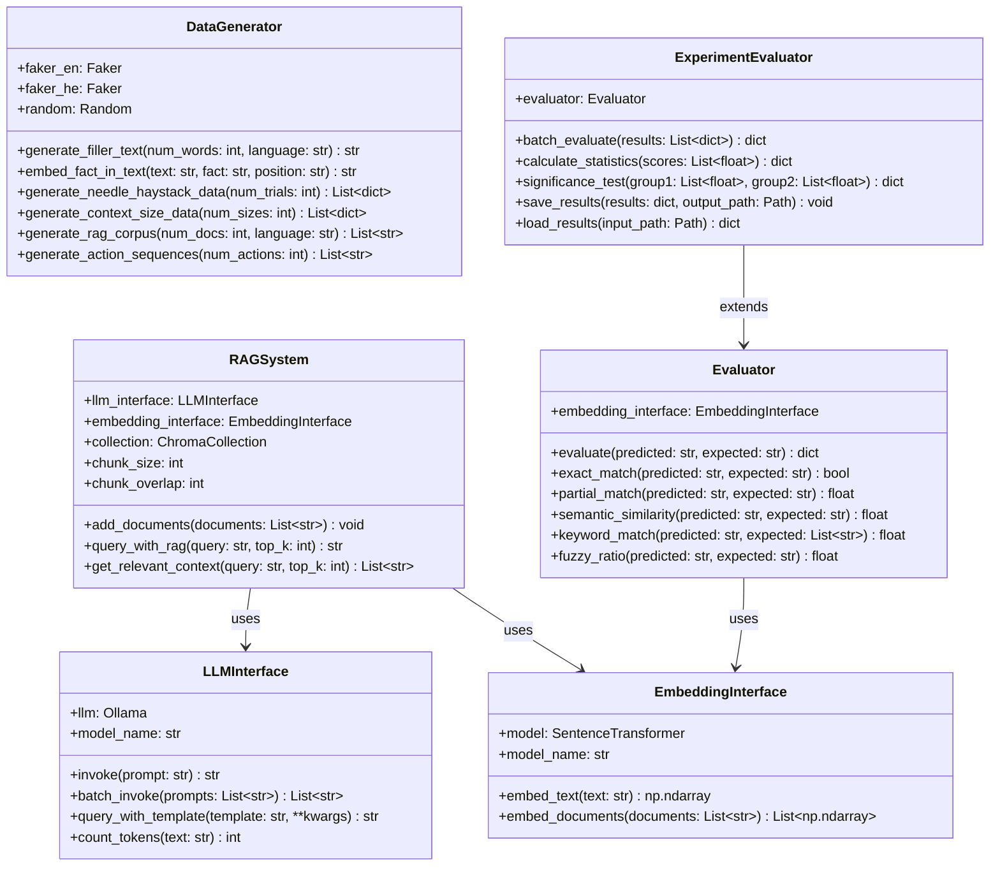
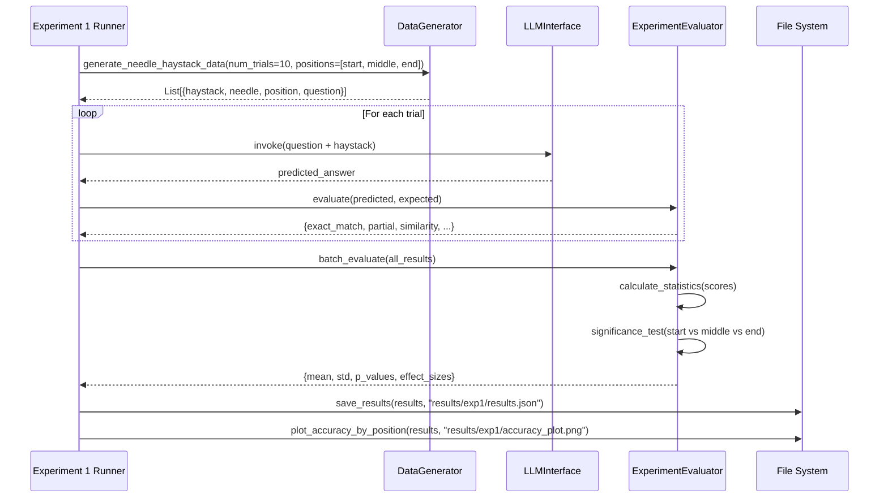
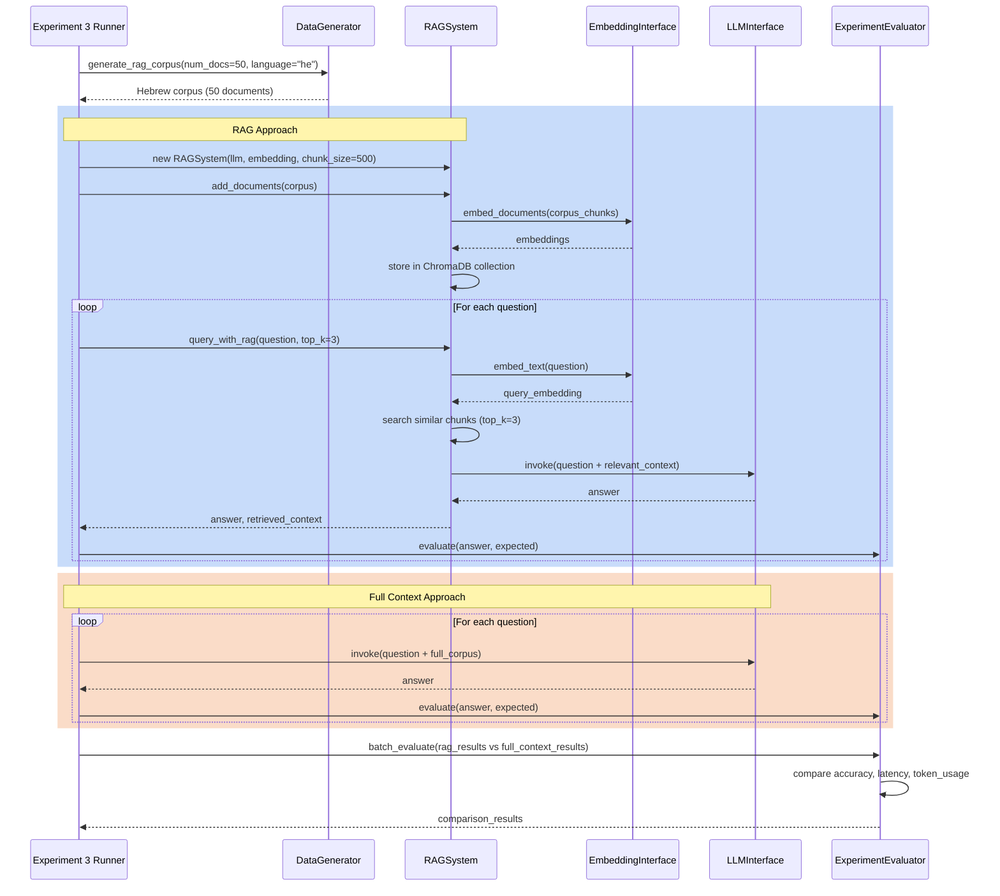
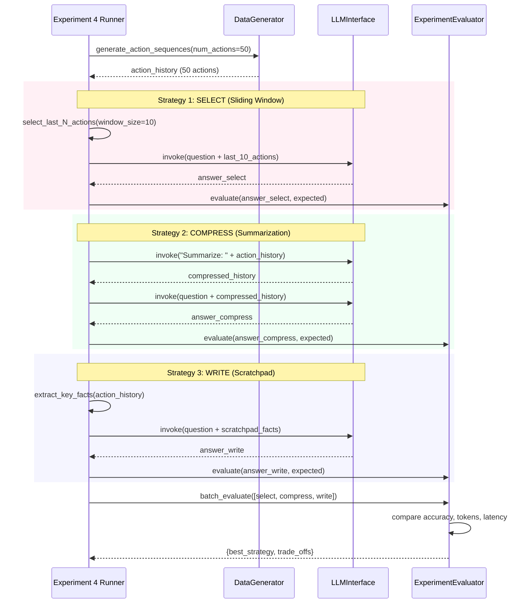

# Architecture Documentation
# Context Windows Lab

**Version**: 1.0.0
**Date**: December 6, 2025
**Author**: Tal Barda
**Course**: LLMs in Multi-Agent Environments

---

## Table of Contents

1. [System Overview](#system-overview)
2. [C4 Model Diagrams](#c4-model-diagrams)
3. [Component Architecture](#component-architecture)
4. [Data Flow](#data-flow)
5. [Technology Stack](#technology-stack)
6. [Deployment Architecture](#deployment-architecture)
7. [Design Decisions (ADRs)](#design-decisions-adrs)
8. [Building Blocks](#building-blocks)
9. [Performance Considerations](#performance-considerations)

---

## 1. System Overview

### 1.1 Context Diagram

```
┌─────────────┐
│   User/     │
│ Researcher  │
└──────┬──────┘
       │
       ▼
┌─────────────────────────────────────────────────┐
│    Context Windows Lab System                   │
│                                                  │
│  - Needle in Haystack Testing                  │
│  - Context Size Impact Analysis                │
│  - RAG Effectiveness Evaluation                │
│  - Context Engineering Strategies              │
└────┬──────────────────────────────────────┬────┘
     │                                       │
     ▼                                       ▼
┌────────────┐                        ┌──────────────┐
│  Ollama    │                        │   ChromaDB   │
│  LLM API   │                        │  (Vector DB) │
└────────────┘                        └──────────────┘
```

### 1.2 System Responsibilities

The Context Windows Lab is a research platform that:

- **Generates** synthetic data for controlled experiments
- **Executes** four independent experiments on LLM context window behavior
- **Measures** accuracy, latency, and token usage metrics
- **Analyzes** results through statistical and visual methods
- **Documents** findings in comprehensive reports

---

## 2. C4 Model Diagrams

### 2.1 Container Diagram

```
┌───────────────────────────────────────────────────────────────┐
│                    Context Windows Lab                         │
│                                                                │
│  ┌──────────────────────────────────────────────────────────┐ │
│  │              Experiment Modules                           │ │
│  │  ┌──────────────┐  ┌──────────────┐  ┌──────────────┐   │ │
│  │  │ Experiment 1 │  │ Experiment 2 │  │ Experiment 3 │   │ │
│  │  │  Needle in   │  │   Context    │  │     RAG      │   │ │
│  │  │   Haystack   │  │     Size     │  │    Impact    │   │ │
│  │  └──────────────┘  └──────────────┘  └──────────────┘   │ │
│  │  ┌──────────────┐                                        │ │
│  │  │ Experiment 4 │                                        │ │
│  │  │  Strategies  │                                        │ │
│  │  └──────────────┘                                        │ │
│  └───────────┬──────────────────────────────────────────────┘ │
│              │                                                 │
│  ┌───────────▼──────────────────────────────────────────────┐ │
│  │              Core Components                              │ │
│  │  ┌──────────────┐  ┌──────────────┐  ┌──────────────┐   │ │
│  │  │     LLM      │  │    Data      │  │   Evaluator  │   │ │
│  │  │  Interface   │  │  Generator   │  │              │   │ │
│  │  └──────────────┘  └──────────────┘  └──────────────┘   │ │
│  └───────────┬──────────────────────────────────────────────┘ │
│              │                                                 │
│  ┌───────────▼──────────────────────────────────────────────┐ │
│  │                 Utility Components                        │ │
│  │  ┌──────────────┐  ┌──────────────┐                      │ │
│  │  │    Metrics   │  │Visualization │                      │ │
│  │  └──────────────┘  └──────────────┘                      │ │
│  └──────────────────────────────────────────────────────────┘ │
└───────────────────────────────────────────────────────────────┘
```

### 2.2 Component Diagram

```
┌─────────────────────────────────────────────────────────┐
│                 src/ (Main Package)                      │
├─────────────────────────────────────────────────────────┤
│                                                          │
│  config.py ─── Global configuration and constants       │
│  __init__.py ── Package initialization                  │
│                                                          │
│  ┌────────────────────────────────────────────────┐     │
│  │  experiments/ (Experiment Modules)             │     │
│  ├────────────────────────────────────────────────┤     │
│  │  exp1_needle_haystack.py                       │     │
│  │  exp2_context_size.py                          │     │
│  │  exp3_rag_impact.py                            │     │
│  │  exp4_strategies.py                            │     │
│  │  __init__.py                                   │     │
│  └────────────────────────────────────────────────┘     │
│                                                          │
│  ┌────────────────────────────────────────────────┐     │
│  │  Core Modules                                  │     │
│  ├────────────────────────────────────────────────┤     │
│  │  llm_interface.py ──── LLM API wrapper         │     │
│  │  data_generator.py ─── Synthetic data creation │     │
│  │  evaluator.py ──────── Accuracy assessment     │     │
│  └────────────────────────────────────────────────┘     │
│                                                          │
│  ┌────────────────────────────────────────────────┐     │
│  │  utils/ (Utility Modules)                      │     │
│  ├────────────────────────────────────────────────┤     │
│  │  metrics.py ───────── Performance metrics      │     │
│  │  visualization.py ──── Chart generation        │     │
│  │  __init__.py                                   │     │
│  └────────────────────────────────────────────────┘     │
│                                                          │
└─────────────────────────────────────────────────────────┘
```

---

## 3. Component Architecture

### 3.1 Experiment Modules

Each experiment module is an independent building block that:

**Input Data:**
- `model_name`: str - LLM model identifier
- `num_documents`: int - Document count for testing
- `words_per_doc`: int - Words per document
- `iterations`: int - Number of test iterations

**Output Data:**
- `results.json`: Complete metrics and responses
- `*.png`: Visualizations (charts, graphs)
- `summary_stats.json`: Statistical summaries

**Setup Data:**
- Temperature: 0.7 (default)
- Top_p: 1.0 (default)
- Max_tokens: 4096 (model-dependent)

### 3.2 Core Components

#### 3.2.1 LLM Interface (`llm_interface.py`)

**Responsibilities:**
- Abstract Ollama API communication
- Handle retries and error recovery
- Track token usage and latency
- Provide consistent interface across experiments

**Input:**
- `prompt`: str - Full prompt text
- `model`: str - Model name
- `temperature`: float - Sampling temperature
- `max_tokens`: int - Maximum output length

**Output:**
- `response`: str - LLM generated text
- `tokens_used`: int - Total tokens consumed
- `latency_ms`: float - Response time

#### 3.2.2 Data Generator (`data_generator.py`)

**Responsibilities:**
- Generate synthetic documents
- Insert "needles" at specified positions
- Create Hebrew corpus for RAG testing
- Ensure reproducibility via random seeds

**Input:**
- `num_docs`: int - Number of documents
- `words_per_doc`: int - Document length
- `needle_position`: str - Where to insert target info

**Output:**
- `documents`: List[str] - Generated documents
- `target_info`: str - Hidden information
- `target_doc_index`: int - Position of needle

#### 3.2.3 Evaluator (`evaluator.py`)

**Responsibilities:**
- Assess answer accuracy (exact, partial, semantic)
- Calculate retrieval metrics
- Provide consistent evaluation across experiments

**Input:**
- `response`: str - LLM answer
- `expected`: str - Ground truth

**Output:**
- `exact_match`: bool - Exact match score
- `partial_match`: float - Partial overlap
- `semantic_similarity`: float - Embedding similarity

### 3.3 Utility Modules

#### Metrics (`metrics.py`)
- Calculate accuracy statistics
- Compute latency percentiles
- Track token consumption
- Generate summary tables

#### Visualization (`visualization.py`)
- Create line charts (trends)
- Create bar charts (comparisons)
- Create heatmaps (position sensitivity)
- Export PNG files with proper labeling

---

## 4. Data Flow

### 4.1 Typical Experiment Flow

```
┌─────────────┐
│   Start     │
│ Experiment  │
└──────┬──────┘
       │
       ▼
┌──────────────────┐
│ Load Config      │
│ (config.py)      │
└──────┬───────────┘
       │
       ▼
┌──────────────────┐
│ Generate Data    │
│(data_generator)  │
└──────┬───────────┘
       │
       ▼
┌──────────────────┐
│  For each test:  │
│                  │
│  1. Build prompt │
│  2. Call LLM     │
│  3. Evaluate     │
│  4. Record       │
└──────┬───────────┘
       │
       ▼
┌──────────────────┐
│ Aggregate Stats  │
│ (metrics.py)     │
└──────┬───────────┘
       │
       ▼
┌──────────────────┐
│ Generate Charts  │
│(visualization)   │
└──────┬───────────┘
       │
       ▼
┌──────────────────┐
│  Save Results    │
│ (JSON + PNG)     │
└──────┬───────────┘
       │
       ▼
┌──────────────┐
│  Complete    │
└──────────────┘
```

### 4.2 RAG-Specific Flow (Experiment 3)

```
┌──────────────────┐
│ Hebrew Corpus    │
│ Generation       │
└──────┬───────────┘
       │
       ▼
┌──────────────────┐
│ ChromaDB         │
│ Indexing         │
│ (embeddings)     │
└──────┬───────────┘
       │
       ▼
┌──────────────────┐
│ Query Execution  │
└──────┬───────────┘
       │
       ├──────────────────┐
       │                  │
       ▼                  ▼
┌──────────────┐   ┌──────────────┐
│ RAG Branch   │   │ Full Context │
│              │   │   Branch     │
│ 1. Retrieve  │   │              │
│    top-K     │   │ 1. Pass all  │
│ 2. Generate  │   │    docs      │
│    answer    │   │ 2. Generate  │
│              │   │    answer    │
└──────┬───────┘   └──────┬───────┘
       │                  │
       └──────┬───────────┘
              │
              ▼
       ┌──────────────┐
       │  Compare     │
       │  Results     │
       └──────────────┘
```

---

## 5. Technology Stack

### 5.1 Core Technologies

| Component | Technology | Version | Purpose |
|-----------|------------|---------|---------|
| **LLM Runtime** | Ollama | Latest | Local LLM inference |
| **Primary Model** | Llama 2 | 7B | Text generation |
| **LLM Framework** | LangChain | 0.3.15+ | LLM orchestration |
| **Vector DB** | ChromaDB | 0.4.22+ | RAG embeddings storage |
| **Embeddings** | sentence-transformers | 2.2.2+ | Semantic similarity |
| **Data Analysis** | Pandas | 2.0+ | Statistical analysis |
| **Numerical** | NumPy | 1.24+ | Array operations |
| **Visualization** | Matplotlib | 3.7+ | Chart generation |
| **Visualization** | Seaborn | 0.12+ | Statistical plots |

### 5.2 Development Tools

- **Python**: 3.10+
- **Package Manager**: pip
- **Testing**: pytest, pytest-cov
- **Notebooks**: Jupyter
- **Version Control**: Git

### 5.3 Infrastructure

- **Operating System**: macOS, Linux, Windows (cross-platform)
- **Minimum RAM**: 8 GB (16 GB recommended for llama2)
- **Storage**: 10 GB for models + experiments
- **Network**: Required for initial model download only

---

## 6. Deployment Architecture

### 6.1 Local Development Setup

```
┌─────────────────────────────────────────────┐
│         Development Machine                  │
│                                              │
│  ┌────────────────────────────────────┐     │
│  │      Python Environment            │     │
│  │      (venv / conda)                │     │
│  │                                    │     │
│  │  ┌──────────────────────────┐     │     │
│  │  │  context-windows-lab/    │     │     │
│  │  │  - src/                  │     │     │
│  │  │  - data/                 │     │     │
│  │  │  - results/              │     │     │
│  │  └──────────────────────────┘     │     │
│  └─────────────┬──────────────────────┘     │
│                │                             │
│  ┌─────────────▼──────────────────────┐     │
│  │      Ollama Server                 │     │
│  │      (localhost:11434)             │     │
│  │                                    │     │
│  │  ┌──────────────────────────┐     │     │
│  │  │  Loaded Models:          │     │     │
│  │  │  - llama2:latest (7B)    │     │     │
│  │  │  - llama3.2 (optional)   │     │     │
│  │  └──────────────────────────┘     │     │
│  └────────────────────────────────────┘     │
│                                              │
└─────────────────────────────────────────────┘
```

### 6.2 Operational Architecture

**Single-Machine Deployment:**
- All components run on same machine
- Ollama serves models via HTTP (localhost)
- ChromaDB runs in-memory (no external server)
- Results saved to local filesystem

**No External Dependencies:**
- No cloud APIs required
- No internet connection after model download
- Fully reproducible offline

---

### 6.3 UML Diagrams

#### 6.3.1 Class Diagram

The following class diagram shows the main classes and their relationships in the system:



**Key Relationships:**
- `RAGSystem` **depends on** both `LLMInterface` and `EmbeddingInterface` for retrieval-augmented generation
- `Evaluator` **uses** `EmbeddingInterface` for semantic similarity calculations
- `ExperimentEvaluator` **extends** `Evaluator` with batch processing and statistical analysis capabilities
- `DataGenerator` is **independent**, generating synthetic data for all experiments

#### 6.3.2 Sequence Diagram: Experiment 1 (Needle in Haystack)

This diagram shows the workflow for testing fact retrieval at different positions in context:



**Key Steps:**
1. Generate synthetic haystacks with embedded needles at different positions
2. Query LLM with each haystack and measure accuracy
3. Evaluate predictions using multiple metrics
4. Calculate statistical significance of position effects
5. Save results and generate visualizations

#### 6.3.3 Sequence Diagram: Experiment 3 (RAG Workflow)

This diagram shows the comparison between RAG and full-context approaches:



**Key Comparisons:**
- **RAG**: Retrieves only top-k relevant chunks (efficient, lower token usage)
- **Full Context**: Processes entire corpus (comprehensive but expensive)
- Metrics: Accuracy, latency, token count, cost

#### 6.3.4 Sequence Diagram: Experiment 4 (Context Engineering Strategies)

This diagram shows the three strategies for managing long action histories:



**Strategy Comparison:**
- **SELECT (Sliding Window)**: Keep only recent N actions (simple, loses history)
- **COMPRESS (Summarization)**: LLM compresses history (preserves key info, 2 LLM calls)
- **WRITE (Scratchpad)**: Extract key facts to memory (efficient, requires fact extraction)

---

## 7. Design Decisions (ADRs)

### ADR-001: Use Ollama for LLM Inference

**Context**: Need local LLM inference for reproducible research

**Decision**: Use Ollama instead of cloud APIs (OpenAI, Anthropic)

**Rationale**:
- **Reproducibility**: Fixed model versions, no API changes
- **Cost**: Zero per-token charges
- **Privacy**: No data leaves local machine
- **Control**: Full parameter control

**Consequences**:
- ✅ Reproducible experiments
- ✅ No API costs
- ❌ Limited model selection
- ❌ Lower accuracy than GPT-4

### ADR-002: Use ChromaDB for RAG

**Context**: Need vector database for Experiment 3

**Decision**: Use in-memory ChromaDB

**Rationale**:
- **Simplicity**: No external server setup
- **Speed**: Fast for small corpora (<100 docs)
- **Portability**: Works on any machine

**Consequences**:
- ✅ Easy setup
- ✅ Fast for experiments
- ❌ Not persistent across runs
- ❌ Limited to memory size

### ADR-003: Separate Experiments as Independent Modules

**Context**: Four distinct experiments needed

**Decision**: Create exp1-exp4 as standalone scripts

**Rationale**:
- **Independence**: Each runs separately
- **Clarity**: Clear responsibilities
- **Testing**: Easy to validate individually

**Consequences**:
- ✅ Modular design
- ✅ Easy debugging
- ❌ Some code duplication
- ❌ Need shared utilities module

### ADR-004: JSON + PNG Output Format

**Context**: Need to save results and visualizations

**Decision**: Save metrics as JSON, charts as PNG

**Rationale**:
- **Interoperability**: JSON readable by any tool
- **Visualization**: PNG universally viewable
- **Analysis**: Can re-process JSON later

**Consequences**:
- ✅ Standard formats
- ✅ Easy sharing
- ❌ Large files for many experiments
- ❌ Manual aggregation across runs

---

## 8. Building Blocks

### 8.1 Building Block: Data Generator

**Type**: Data Processing Component

**Input Data:**
- `num_documents`: int (2-50)
- `words_per_document`: int (50-500)
- `needle_position`: str ["start", "middle", "end"]
- `language`: str ["english", "hebrew"]

**Output Data:**
- `documents`: List[str] - Generated text documents
- `target_doc_index`: int - Index of document with hidden info
- `target_info`: dict - The information to find

**Setup Data:**
- `random_seed`: int = 42 (for reproducibility)
- `topic_pool`: List[str] - Available topics
- `generation_mode`: str = "synthetic" or "corpus"

**Validation:**
- num_documents must be > 0
- words_per_document must be >= 50
- needle_position must be in valid set
- Raises ValueError on invalid input

### 8.2 Building Block: LLM Interface

**Type**: External API Wrapper

**Input Data:**
- `prompt`: str (1-100,000 characters)
- `model`: str (valid Ollama model name)
- `temperature`: float (0.0-2.0)
- `max_tokens`: int (1-4096)

**Output Data:**
- `response`: str - Generated text
- `tokens_used`: int - Total tokens consumed
- `latency_ms`: float - Time taken
- `success`: bool - Whether call succeeded

**Setup Data:**
- `ollama_base_url`: str = "http://localhost:11434"
- `timeout`: int = 120 (seconds)
- `retry_attempts`: int = 3

**Validation:**
- Prompt cannot be empty
- Temperature must be in [0, 2]
- Max_tokens must be positive
- Raises ConnectionError if Ollama unavailable

### 8.3 Building Block: Evaluator

**Type**: Assessment Component

**Input Data:**
- `llm_response`: str
- `expected_answer`: str or dict
- `evaluation_mode`: str ["exact", "partial", "semantic"]

**Output Data:**
- `exact_match`: bool
- `partial_score`: float (0.0-1.0)
- `semantic_similarity`: float (0.0-1.0)
- `keyword_match_count`: int

**Setup Data:**
- `similarity_threshold`: float = 0.7
- `keyword_list`: List[str] - Expected keywords
- `case_sensitive`: bool = False

**Validation:**
- Responses cannot be None
- Evaluation mode must be valid
- Similarity threshold in [0, 1]
- Raises TypeError on invalid input types

---

## 9. Performance Considerations

### 9.1 Multiprocessing Strategy

**CPU-Bound Operations:**
- ✅ LLM inference (delegated to Ollama, uses all cores)
- ✅ Embedding generation (sentence-transformers multithreaded)

**I/O-Bound Operations:**
- ✅ Ollama API calls (HTTP requests)
- ✅ File I/O (JSON saving, PNG writing)
- ✅ ChromaDB queries (disk/memory I/O)

**Current Implementation:**
- **Sequential execution** within each experiment
- **Parallel capability** for running multiple experiments simultaneously
- **Batching**: Not implemented (low iteration counts)

**Future Improvements:**
- Could parallelize iterations using `multiprocessing.Pool`
- Would reduce Exp2 runtime from ~98s to ~20s (5 parallel processes)
- Trade-off: Higher memory usage, potential race conditions

### 9.2 Memory Management

- **Peak Memory**: ~4 GB (llama2 model loaded)
- **Per-Document**: ~1 KB (small synthetic docs)
- **Embeddings**: ~1.5 MB for 20-doc corpus
- **Total Experiment**: <5 GB typical

### 9.3 Latency Optimization

| Operation | Current | Optimized | Method |
|-----------|---------|-----------|--------|
| LLM call | 0.8-2.5s | 0.8s | Can't optimize (model-bound) |
| Data gen | 0.1s | 0.05s | Pre-generate, cache |
| Evaluation | 0.01s | 0.005s | Vectorize comparisons |
| Visualization | 0.5s | 0.5s | Already fast |

**Total Runtime:**
- Current: 3m 44s (all 4 experiments)
- Optimized: Could reach ~2m with caching

---

## 10. Security Considerations

### 10.1 API Keys

- **None Required**: Ollama is local, no API keys
- **Future**: If using cloud LLMs, use environment variables
- **Best Practice**: Never commit .env files

### 10.2 Data Privacy

- **All Local**: No data transmitted externally
- **Synthetic Data**: No PII in experiments
- **Hebrew Corpus**: Generic topics only

### 10.3 Input Validation

- All building blocks validate inputs
- Type checking enforced
- Range validation for numerical params
- Graceful error messages

---

## 11. Extensibility

### 11.1 Adding New Experiments

1. Create `src/experiments/exp5_newexperiment.py`
2. Implement standard interface:
   ```python
   def run_experiment(config: dict) -> dict:
       # Setup
       # Execute
       # Analyze
       return results
   ```
3. Add to `scripts/run_all_experiments.sh`
4. Document in `docs/RESULTS.md`

### 11.2 Adding New Models

1. Pull model: `ollama pull newmodel`
2. Update `config.py`: add to `SUPPORTED_MODELS`
3. Test with Experiment 1 first
4. Document performance characteristics

### 11.3 Adding New Metrics

1. Add function to `src/utils/metrics.py`
2. Call from experiment modules
3. Include in output JSON
4. Visualize if relevant

---

## 12. Maintenance

### 12.1 Version Management

- **Ollama**: Check monthly for updates
- **Python Packages**: Update quarterly, test thoroughly
- **Models**: Pin to specific versions for reproducibility

### 12.2 Testing

- **Unit Tests**: Validate individual components
- **Integration Tests**: Full experiment runs
- **Regression Tests**: Ensure results consistency

### 12.3 Documentation

- **Code Comments**: Inline for complex logic
- **Docstrings**: All public functions
- **Architecture**: This document, update with changes
- **Results**: Update RESULTS.md after experiments

---

## Appendix A: File Structure

```
context-windows-lab/
├── src/
│   ├── __init__.py
│   ├── config.py
│   ├── llm_interface.py
│   ├── data_generator.py
│   ├── evaluator.py
│   ├── experiments/
│   │   ├── __init__.py
│   │   ├── exp1_needle_haystack.py
│   │   ├── exp2_context_size.py
│   │   ├── exp3_rag_impact.py
│   │   └── exp4_strategies.py
│   └── utils/
│       ├── __init__.py
│       ├── metrics.py
│       └── visualization.py
├── tests/                      # Future: unit tests
├── docs/
│   ├── ARCHITECTURE.md         # This file
│   ├── PRD.md
│   ├── RESULTS.md
│   └── API.md                  # Future: API reference
├── data/                       # Generated datasets
├── results/                    # Experiment outputs
├── notebooks/                  # Analysis notebooks
├── scripts/
│   ├── setup_environment.sh
│   └── run_all_experiments.sh
├── pyproject.toml              # Package definition
├── requirements.txt            # Python dependencies
├── README.md
└── .gitignore
```

---

**Document Version**: 1.0.0
**Last Updated**: December 6, 2025
**Next Review**: After significant architectural changes
