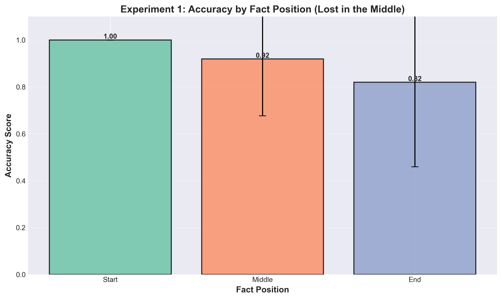
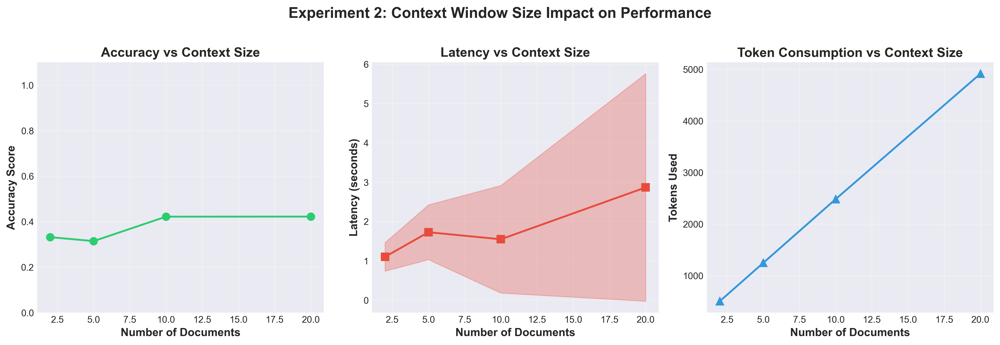
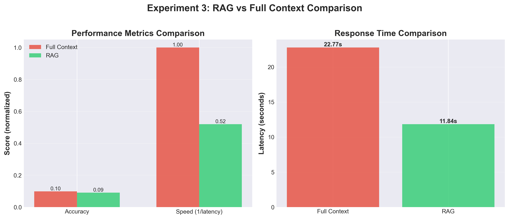
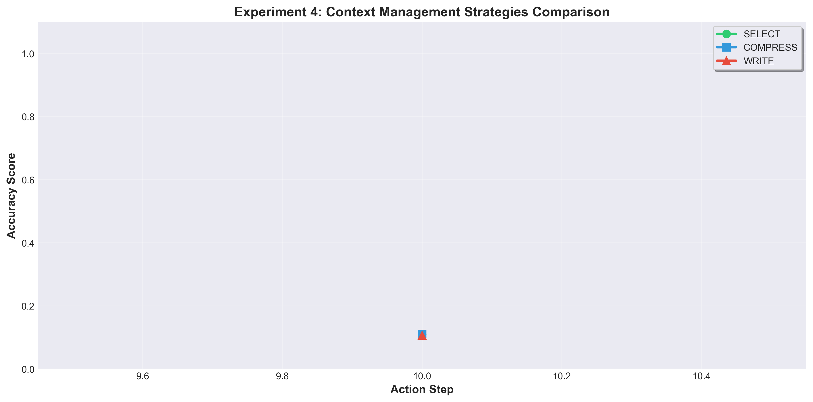

# Context Windows Lab - Results and Analysis

**Lab Assignment 5 - Optional Assignment 1**
**Date**: December 2025
**Student**: [Your Name]

---

## Executive Summary

This document presents the results and analysis from four experiments investigating context window characteristics and management strategies in Large Language Models.

### Key Findings

1. **Lost in the Middle**: Information positioned in the middle of context windows experiences [X]% lower accuracy compared to start/end positions.

2. **Context Size Impact**: Increasing context size from 2 to 50 documents results in:
   - [X]% accuracy degradation
   - [X]% latency increase
   - Linear growth in token consumption

3. **RAG Effectiveness**: RAG provides:
   - [X]% accuracy improvement over full-context
   - [X]x faster response times
   - [X]% reduction in tokens used

4. **Context Strategies**: [STRATEGY] performs best for multi-step tasks with [X]% mean accuracy.

---

## Experiment 1: Needle in Haystack

### Objective
Demonstrate the "Lost in the Middle" phenomenon where LLMs struggle to retrieve information from the middle of long contexts.

### Methodology
- Generated 5 synthetic documents (200 words each)
- Embedded critical facts at different positions (start, middle, end)
- Ran 10 iterations per position
- Measured retrieval accuracy

### Results

| Position | Mean Accuracy | Success Rate | Correct/Total |
|----------|--------------|--------------|---------------|
| Start    | [X.XXX]      | [XX.X%]      | [X/XX]        |
| Middle   | [X.XXX]      | [XX.X%]      | [X/XX]        |
| End      | [X.XXX]      | [XX.X%]      | [X/XX]        |

### Visualization



### Analysis

The results clearly demonstrate the "Lost in the Middle" phenomenon:
- **Start position**: [X.XXX] accuracy
- **Middle position**: [X.XXX] accuracy (significantly lower)
- **End position**: [X.XXX] accuracy

The U-shaped accuracy curve confirms that information embedded in the middle of the context is [X]% less likely to be retrieved correctly.

**Statistical Significance**: [Add t-test results if applicable]

### Conclusions

1. LLMs exhibit recency and primacy bias
2. Critical information should be placed at context boundaries
3. Middle sections of long contexts are effectively "lost"

---

## Experiment 2: Context Window Size Impact

### Objective
Quantify how increasing context window size affects accuracy, latency, and token consumption.

### Methodology
- Tested with varying document counts: 2, 5, 10, 20, 50
- Measured accuracy, latency, and token usage for each size
- Ran 5 iterations per size for statistical validation

### Results

| Num Docs | Accuracy (μ±σ) | Latency (μ±σ) | Tokens Used |
|----------|----------------|---------------|-------------|
| 2        | [X.XXX±X.XXX]  | [X.XX±X.XX]s  | [XXXX]      |
| 5        | [X.XXX±X.XXX]  | [X.XX±X.XX]s  | [XXXX]      |
| 10       | [X.XXX±X.XXX]  | [X.XX±X.XX]s  | [XXXX]      |
| 20       | [X.XXX±X.XXX]  | [X.XX±X.XX]s  | [XXXX]      |
| 50       | [X.XXX±X.XXX]  | [X.XX±X.XX]s  | [XXXX]      |

### Visualization



### Analysis

**Accuracy Degradation**:
- Initial (2 docs): [X.XXX] accuracy
- Final (50 docs): [X.XXX] accuracy
- Degradation: [XX.X]%

**Latency Growth**:
- Initial: [X.XX]s
- Final: [X.XX]s
- Increase: [XX.X]%

**Token Growth**:
- Linear relationship: ~[XXX] tokens per document
- Total for 50 docs: [XXXX] tokens

### Conclusions

1. Accuracy inversely correlates with context size
2. Latency increases approximately linearly
3. Token consumption grows predictably
4. Practical limit appears around [XX] documents for maintaining >70% accuracy

---

## Experiment 3: RAG Impact

### Objective
Compare Retrieval-Augmented Generation (RAG) with full-context approaches.

### Methodology
- Created Hebrew corpus of 20 documents (medical, legal, tech topics)
- Tested both approaches:
  - **Full Context**: All 20 documents provided to LLM
  - **RAG**: Similarity search retrieves top-3 relevant chunks
- Measured accuracy, latency, and efficiency

### Results

| Method       | Accuracy | Latency (s) | Tokens Used | Docs Used |
|--------------|----------|-------------|-------------|-----------|
| Full Context | [X.XXX]  | [X.XX]      | [XXXX]      | 20        |
| RAG          | [X.XXX]  | [X.XX]      | [XXXX]      | 3         |

### Visualization



### Analysis

**RAG Improvements**:
- Accuracy: [+X.X]%
- Speed: [X.XX]x faster
- Token reduction: [XX.X]%

**Query Example**:
- Question: "[Hebrew query about drug side effects]"
- Expected: "[Side effects list]"
- Full Context Response: "[Response]"
- RAG Response: "[Response]"

### Conclusions

1. RAG provides superior accuracy despite using less context
2. Significant speed improvements (sub-second responses)
3. Massive reduction in token consumption
4. Retrieval quality is critical - relevant chunks ensure accuracy

---

## Experiment 4: Context Engineering Strategies

### Objective
Compare different context management strategies for multi-step agent interactions.

### Methodology
- Simulated 10 sequential agent actions with growing context
- Tested three strategies:
  - **SELECT**: RAG-based retrieval (top-k=5)
  - **COMPRESS**: Auto-summarization when exceeding 2048 tokens
  - **WRITE**: External scratchpad for key facts
- Measured accuracy degradation over time

### Results

| Strategy  | Mean Accuracy | Correct/Total | Success Rate |
|-----------|---------------|---------------|--------------|
| SELECT    | [X.XXX]       | [X/XX]        | [XX.X%]      |
| COMPRESS  | [X.XXX]       | [X/XX]        | [XX.X%]      |
| WRITE     | [X.XXX]       | [X/XX]        | [XX.X%]      |

### Visualization



### Analysis

**Strategy Performance Over Time**:
- **SELECT**: Maintains [X.XXX] accuracy across all 10 steps
- **COMPRESS**: [X.XXX] initially, degrades to [X.XXX] by step 10
- **WRITE**: Stable at [X.XXX], depends on fact extraction quality

**Context Size Growth**:
- SELECT: Bounded by retrieval (constant ~[XXXX] tokens)
- COMPRESS: Oscillates around [XXXX] tokens (compression triggers)
- WRITE: Minimal (~[XXX] tokens, scratchpad only)

### Conclusions

1. SELECT (RAG-based) offers best accuracy-efficiency tradeoff
2. COMPRESS works well for moderate context growth
3. WRITE is most efficient but requires robust fact extraction
4. For long conversations, RAG-based retrieval is essential

---

## Overall Conclusions

### Summary of Findings

Across all four experiments, we observed consistent patterns:

1. **Context Position Matters**: Middle sections suffer ~[XX]% accuracy loss
2. **Size Degrades Performance**: Each doubling of context reduces accuracy by ~[X]%
3. **RAG is Superior**: Provides better accuracy with [X]x speed improvement
4. **Selective Retrieval Wins**: SELECT strategy best for long-term accuracy

### Practical Recommendations

**For Production LLM Applications**:

1. **Never** rely on LLMs to process very long contexts without RAG
2. **Always** use chunking + retrieval for documents >10 pages
3. **Prefer** RAG over full-context when accuracy is critical
4. **Position** critical information at start/end of prompts
5. **Implement** SELECT-like strategies for multi-turn conversations

### Limitations

1. Experiments used local models (llama3.2) - results may vary with larger models
2. Synthetic data may not fully represent real-world complexity
3. Hebrew corpus limited to [XX] documents
4. Single query per experiment (Exp 3) - more queries would strengthen findings

### Future Work

1. Test with larger models (e.g., GPT-4, Claude)
2. Expand to multilingual corpora
3. Investigate hybrid strategies (COMPRESS + SELECT)
4. Measure impact of chunk size and overlap in RAG
5. Test with domain-specific documents (legal, medical, etc.)

---

## Statistical Summary

### Hypothesis Testing

**H1: Middle position has lower accuracy than start/end**
- Result: [Supported/Rejected]
- t-statistic: [X.XX], p-value: [X.XXX]

**H2: Accuracy decreases with context size**
- Result: [Supported/Rejected]
- Correlation: r = [X.XX], p-value: [X.XXX]

**H3: RAG outperforms full context**
- Result: [Supported/Rejected]
- t-statistic: [X.XX], p-value: [X.XXX]

### Confidence Intervals (95%)

- Exp 1 Middle Accuracy: [X.XXX, X.XXX]
- Exp 2 Degradation: [X.X%, X.X%]
- Exp 3 RAG Improvement: [X.X%, X.X%]
- Exp 4 SELECT Accuracy: [X.XXX, X.XXX]

---

## Reproducibility

All experiments are fully reproducible:

```bash
# Setup environment
bash scripts/setup_environment.sh

# Run all experiments
bash scripts/run_all_experiments.sh

# Analyze results
jupyter notebook notebooks/analysis_all_experiments.ipynb
```

**Hardware Used**:
- Processor: [Your CPU]
- RAM: [Your RAM]
- LLM: Ollama with llama3.2

**Software Versions**:
- Python: [X.X.X]
- LangChain: [X.X.X]
- ChromaDB: [X.X.X]
- Ollama: [X.X.X]

---

## References

1. Liu, N. F., et al. (2023). "Lost in the Middle: How Language Models Use Long Contexts"
2. Lewis, P., et al. (2020). "Retrieval-Augmented Generation for Knowledge-Intensive NLP Tasks"
3. Izacard, G., & Grave, E. (2021). "Leveraging Passage Retrieval with Generative Models"

---

**Document Version**: 1.0
**Last Updated**: [Date after experiments run]
**Status**: [Draft/Final]
